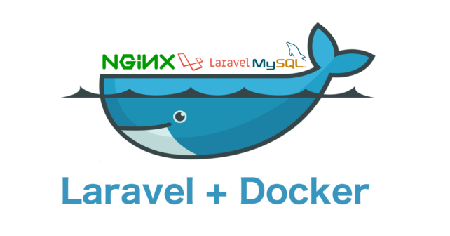
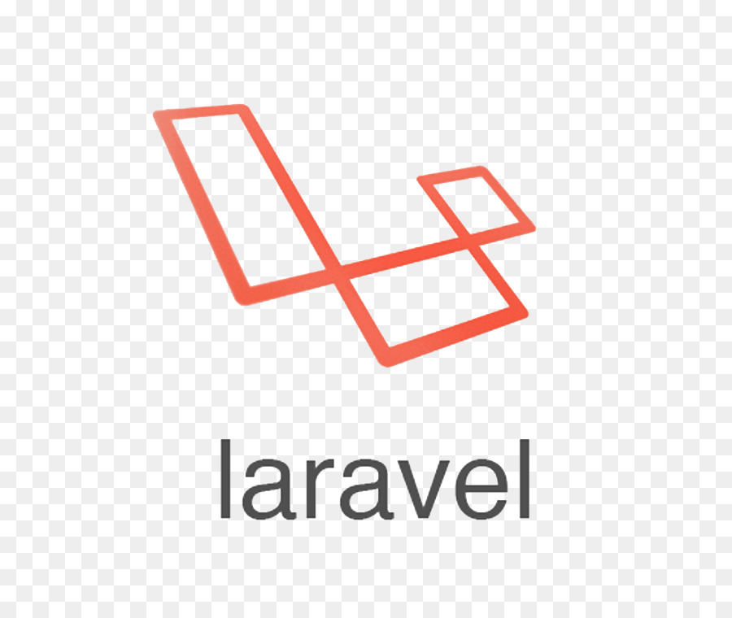
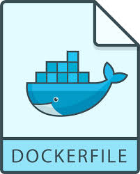

## Dockerizing Laravel Application With Nginx,Mysql on Ubuntu

Bir laravel projesini sanallaştırma teknolojilerini kullanarak nasıl ayağa kaldırırız?

Bu projede bir tane docker composer oluşturup bir container'da web sunucusu olarak ngnix, bir başka container'da db olarak mysql, bir başka container'da da uygulamamız'ın koşmasını hedefliyoruz.Sonuç olarak projemizde docker composer kullanarak toplam 3 tane ayrı container kullanmış olacağız ve bunlar bir birleri ile etkilşim halinde olmuş olacaklar.

## 1-Laravel Kütüphanesini Projeye İmport Edelim

Aşağıdaki komut satırı ile laravel kütüphanesini Projemize clone edelim.

    - $ git clone https://github.com/laravel/laravel.git Dockerizing-laravel-App

## 2-Docker Composer'ı Projemize Kuralım

Composer'ı kullanabilmek için projemizin ana dizininde kurulumu yapalım.
    
    - $ cd ~/laravel-app
    
    - $ docker run --rm -v $(pwd):/app composer install
    
## 3-Docker Compose File Oluşturalım.

Projemizde kullacağımız image 'leri tanımlamak için Docker-Compose dosyası oluşturalım.

    - $ nano ~/laravel-app/docker-compose.yml

## 4-Docker Compose Dosyasını Projemizin Niteliklerine Göre Düzenleyelim.

Projemizde kullanmamız gereken 3 tane container var.Bu container'ları oluşturucağımız docker-compose.yml dosyasında tanımlayıp sonra build edeceğiz.Eğer bir den fazla container kullanmak istiyorsak compose kullanılmalıdır.Eğer sadece bir tane container kullacaksak Dockerfile da tanımlamaları yapmak yeterli olacaktır.

## 5- Docker File dosyasını OLuşturalım.

Docker ayağa kalkacağı zaman proje path'inin belirlenmesi ,sistem paketlerinin güncellenmesi,Composer'ın kurulumu,cache 'in temizlenmesi projedeki dosyaların root izni olmadan yürütülmesi için gerekli tanımlamaların ve yetkilerin verildiği dosyadır.

Aslında Dockerfile içersinde oluşturduğum her bir component(mysql,apache,ngnix..) Dockerfile derlendikten sonra adı,id'si gibi özellikleri olan birer image 'dir.

## 6- Projemize php klasörü oluşturalım.

- $ mkdir ~/Dockerizing-Laravel-App-On-Ubuntu/php

Proje dizinine dosya upload etmek için izin verilen maximum boyutlar set edilmiştir.

- nano ~/laravel-app/php/local.ini

    upload_max_filesize=40M;
    post_max_size=40M

## 7- Nginx Web Server Yapılandırma

İlk önce /nginx/conf.d dizinini oluşturalım.

 
