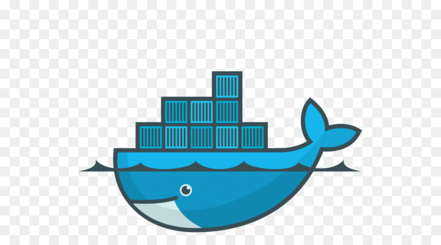

## Dockerizing Laravel Application With Nginx,Mysql on Ubuntu

Bir laravel projesini sanallaştırma teknolojilerini kullanarak nasıl ayağa kaldırırız?

Bu projede bir tane docker composer oluşturup bir container'da web sunucusu olarak ngnix, bir başka container'da db olarak mysql, bir başka container'da da uygulamamız'ın koşmasını hedefliyoruz.Sonuç olarak projemizde docker composer kullanarak toplam 3 tane ayrı container kullanmış olacağız ve bunlar bir birleri ile etkilşim halinde olmuş olacaklar.

## 1-Laravel Kütüphanesini Projeye İmport Edelim

Aşağıdaki komut satırı ile laravel kütüphanesini Projemize clone edelim.

    - $ git clone https://github.com/laravel/laravel.git Dockerizing-laravel-App

## 2-Docker Composer'ı Projemize Kuralım

Composer'ı kullanabilmek için projemizin ana dizininde kurulumu yapalım.
    
    - $ cd ~/laravel-app
    
    - $ docker run --rm -v $(pwd):/app composer install
    
## 3-Docker Compose File Oluşturalım.

Projemizde kullacağımız image 'leri tanımlamak için Docker-Compose dosyası oluşturalım.

    - $ nano ~/laravel-app/docker-compose.yml
    
## 4-     
 
